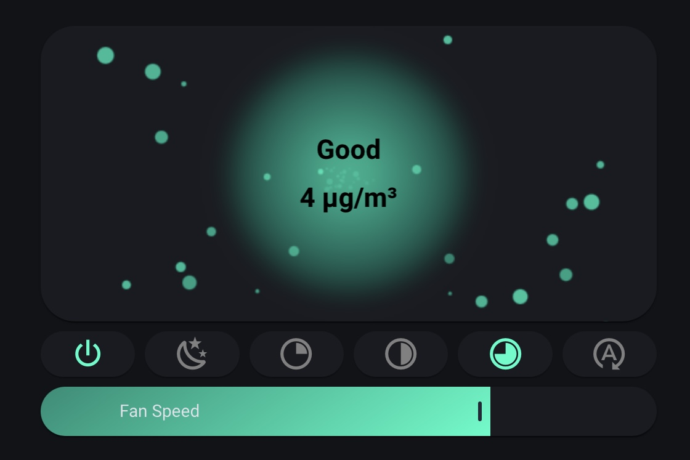
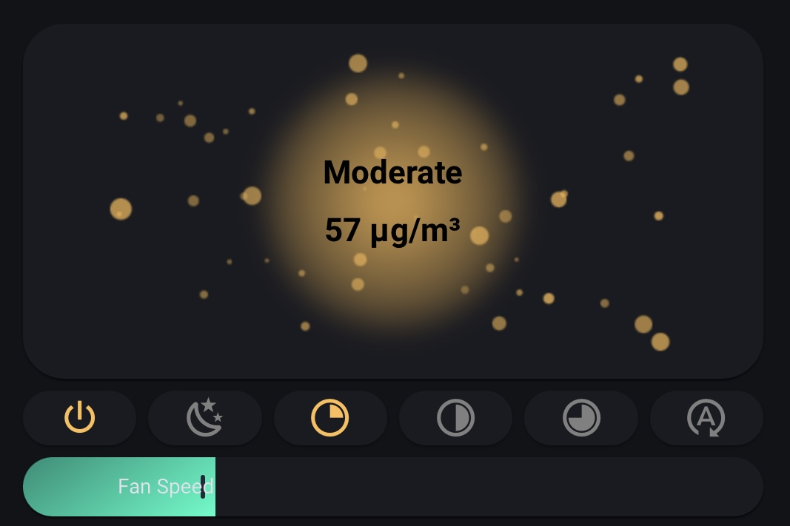
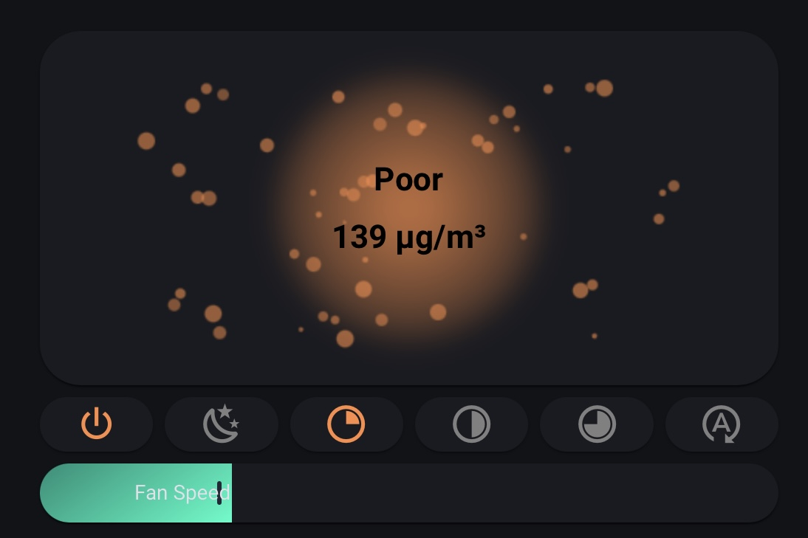
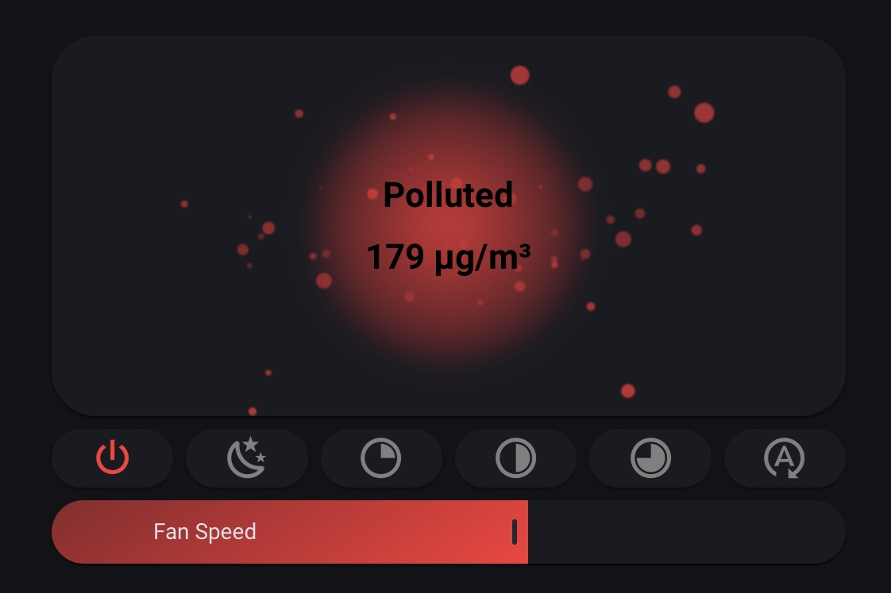

# Xiaomi Air Purifier Dashboard Card for Home Assistant

This project recreates the Xiaomi Air Purifier UI in Home Assistant using fully custom YAML and lightweight styling, replicating the glowing air ring and smart control buttons found in the official Mi Home app.


*Aesthetic recreation with colour-adaptive ring, animated background, and dynamic speed control.*

---

## 🌫️ Overview

This custom dashboard card visualises real-time PM2.5 air quality levels using animated radial gradients and floating particle dots. It also includes:

- Air purifier controls (power, preset modes, and favourite levels)
- Custom slider to adjust fan speed
- Colour-coded visual indicator based on air quality
- Support for Xiaomi purifier entities via MQTT or cloud

---

## 🎨 Air Quality Colour Codes

| Air Quality  | PM2.5 Range (µg/m³) | Label     | Colour  |
|--------------|----------------------|-----------|---------|
| Good         | ≤ 35                 | `Good`    | Green   |
| Moderate     | 36–75                | `Moderate`| Orange  |
| Poor         | 76–150               | `Poor`    | Amber   |
| Polluted     | > 150                | `Polluted`| Red     |

---

## 📸 Screenshots

### Good (≤ 35 µg/m³)


### Moderate (36–75 µg/m³)


### Poor (76–150 µg/m³)


### Polluted (> 150 µg/m³)


---

## 🧪 How It Works

- A `button-card` overlays the central radial glow and shows the current PM2.5 reading along with a text label (Good, Moderate, etc.)
- A `config-template-card` injects the PM2.5 value into a local `dots_canvas.html` file via iframe to render animated air particles
- The glow and icon colours dynamically respond to the sensor value, changing shades and intensity
- Full fan control is integrated with preset modes and a slider

---

## 📂 File Structure

Place these in your Home Assistant configuration directory:

```
/config/
├── www/
│   └── dots_canvas.html      # HTML animated dot background
├── dashboards/
│   └── xiaomi_air.yaml       # The full vertical-stack YAML
```

Ensure `/config/www/dots_canvas.html` is accessible at `/local/dots_canvas.html`.

---

## 📦 Requirements

- Home Assistant 
- HACS with the following custom cards installed:
  - [`button-card`](https://github.com/custom-cards/button-card)
  - [`config-template-card`](https://github.com/iantrich/config-template-card)
  - [`my-slider-v2`]

- Xiaomi purifier and PM2.5 sensor integration via:
  - Xiaomi Miio
  - MQTT
  - Or any compatible air quality sensor

---

## 🔧 PM Animation Explained (iframe injection)

The animated background is a custom HTML file (`dots_canvas.html`) with dynamic control of the particles using PM2.5 values passed via the iframe `url`:

```yaml
type: custom:config-template-card
variables:
  pm: states['sensor.xiaomi_cpa4_4c01_pm25_density'].state
entities:
  - sensor.xiaomi_cpa4_4c01_pm25_density
card:
  type: iframe
  url: ${"/local/dots_canvas.html?pm25=" + pm}
```

In the HTML, JavaScript parses the `pm25` value and adjusts the particle density, colour, and speed accordingly:

```js
const pm25 = parseFloat(new URLSearchParams(window.location.search).get("pm25"));
```

This lets the iframe act as a live particle ring that adapts to real-world air quality data.

---

## 📋 YAML Preview

A full copy of the card YAML can be found in [`xiaomi_air.yaml`](custom_cards/xiaomi_air.yaml).

You can also paste it directly into your dashboard as a `vertical-stack` card.

---

## 📌 To Do

- [ ] Add CO2/Temperature display
- [ ] Build Blueprint version for easier import
- [ ] Package it as a Home Assistant Dashboard resource

---

